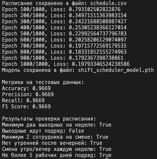
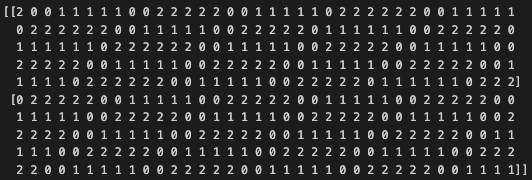

# Генерация графика работы сотрудников

### Правила генерации:
1. Должно быть минимум два выходных на неделе.
2. Выходные должны идти друг за другом.
3. В каждой смене должно быть минимум по 2 сотрудника на каждый день.
4. После вечерней смены не может быть утренней, чтобы человек был не уставший.
5. Каждую неделю менять у сотрудника смены с вечерней на утреннюю и обратно.
6. У человека не может быть больше 5 рабочих дней подряд.

---

## Описание модели
Модель используется для генерации и проверки расписания сотрудников. Она обучается на основе данных с шумами и предсказывает расписание, соответствующее заданным правилам.

**Размер и скорость модели зависят от:**
- Количества слоев и нейронов в каждом слое.
- Используемых функций активации.
- Объема входных данных (число сотрудников и дней).

Модель в представленном виде будет иметь размер около **49 КБайт**.

**Выполнение происходит на CPU**.

Ниже представлен пример работы `main.py`:



Пример сгенерированных данных:



---

## Установка и запуск проекта (Linux, macOS)

1. Убедитесь, что у вас установлен Python 3.10 или выше.
2. Установите зависимости:
   ```bash
   pip install -r requirements.txt
   ```

2. Запустите проекта:
   ```bash
   python3 main.py
   ```
3. Для работы с Jupyter Notebook:
   ```bash
   jupyter notebook notebooks/shift_scheduler.ipynb
   ```

---

### Файлы проекта
`main.py`: Точка входа для запуска генерации и проверки расписания.
`src/`: Исходный код проекта.
`src/constants.py`: Константы проекта.
`src/schedule_generator.py`: Логика генерации расписания.
`src/schedule_model.py`: Определение модели.
`src/schedule_validator.py`: Проверка расписания на соответствие правилам.
`notebooks/shift_scheduler.ipynb`: Jupyter Notebook для интерактивной работы.
`requirements.txt`: Список зависимостей.

___

## Использованные методы

Для выполнения задачи были применены следующие подходы:

1. **Архитектура модели**:
   - Экспериментировал с разными архитектурами нейронной сети, включая изменение количества слоев и нейронов.
   - Оптимизировал размер модели для минимизации веса и ускорения работы.

2. **Генерация данных**:
   - Добавлял шум в данные для повышения устойчивости модели.
   - Перемешивал строки данных (шафлинг) для улучшения генерализации.
   - Экспериментировал с объемом подаваемых данных.
   - Пробовал разные методы генерации данных.
